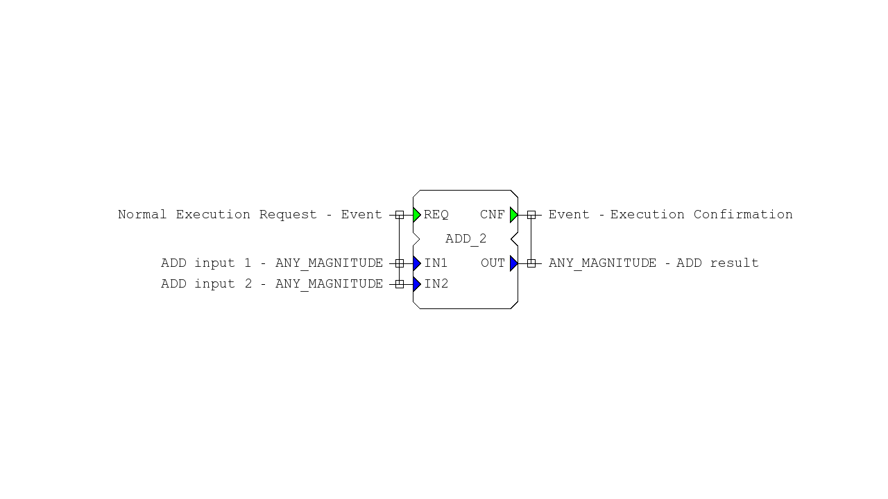

# IEC 61499 Functional Block Visualizer
## 📋 Описание проекта
Эта библиотека автоматически создает PNG-изображения функциональных блоков IEC 61499 на основе их XML-описаний. Визуализация соответствует стандарту IEC 61499 и отображает все элементы функционального блока: события, данные, связи между ними и комментарии.

<div align="center">
    
    Пример PNG-изображения функциональных блоков IEC 61499
</div>

## ✨ Основные возможности

- **Сохранение в PNG**

- **Предпросмотр**

- **Поддержка всех элементов**

- **Стилизация по стандарту IEC 61499**

## 🏗️ Структура проекта
```text

├── CMakeLists.txt
├── include/
│   ├── Parser.h
│   ├── FB_lib_graphic.h
│   └── FB_Visualizer.h
├── src/
│   ├── main.cpp
│   ├── Parser.cpp
│   ├── FB_lib_graphic.cpp
│   └── FB_Visualizer.cpp
├── test_data_xml/
│   |── ADD_2.xml
|   └── ......
└── README.md
```
## 📦 Зависимости
Проект автоматически загружает и собирает все зависимости через CMake:

- **C++17** или выше
- **SFML** 2.6.1
- **pugixml** 1.14

**Не требуется ручная установка зависимостей!**

## 🚀 Быстрый старт
### Linux
```bash
git clone https://github.com/BRoman15/PNG-image-of-the-IEC-61499-function-block.git
cd PNG-image-of-the-IEC-61499-function-block

#Создайте директорию для сборки
mkdir build
cd build

#Настройте проект с помощью CMake
cmake ..
make

#Запуск
cd build
./main
```
### Windows (MinGW)
```bash
git clone https://github.com/BRoman15/PNG-image-of-the-IEC-61499-function-block.git
cd PNG-image-of-the-IEC-61499-function-block

#Создайте директорию для сборки
mkdir build
cd build

#Настройте проект с помощью CMake
cmake .. -G "MinGW Makefiles"
cmake -build .

#Запуск
cd build
./main.exe
```

## 👨‍💻 Авторы

- **BRoman15** - *Разработчик* - [Мой GitHub](https://github.com/BRoman15)

## 🙏 Благодарности
- [pugixml](https://github.com/zeux/pugixml.git)
- [SFML](https://github.com/SFML/SFML.git)


